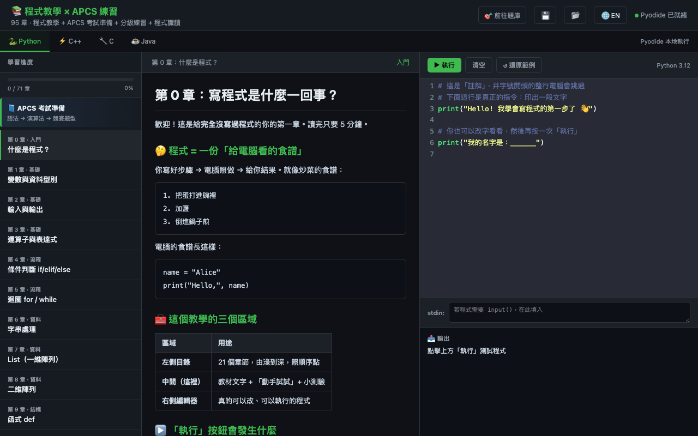
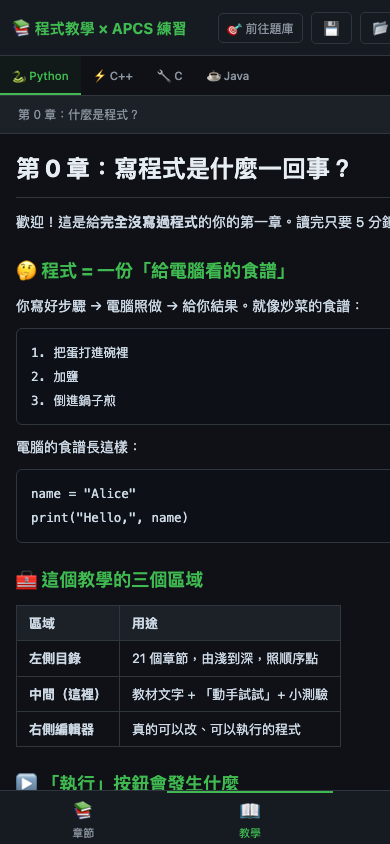
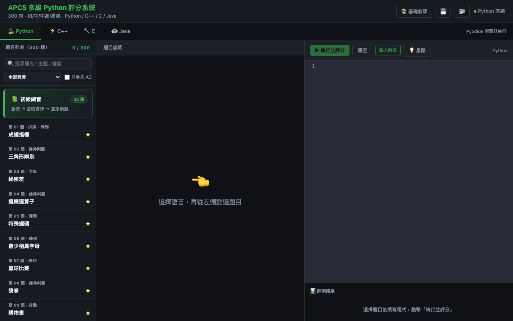

# 互動程式教室 × APCS 練習 / Interactive Coding Classroom × APCS Practice

> 從零基礎到進階：Python · C++ · C · Java 四語言、95 章互動教學，搭配 300 題 APCS 分級題庫與 1477 題程式判讀練習，再加上 AI 拍照解題與統一錯題本——全部在瀏覽器內完成，零安裝、零後端、零註冊。
> Learn to code from zero in four languages — 95 interactive chapters, a 300-problem tiered APCS judge, a 1477-question code-reading drill, plus an AI photo solver and a unified mistakes book, entirely in the browser. No install, no backend, no signup.

📚 **程式教學 / Tutorial**：**https://yu-0312.github.io/apcs-judge/tutorial.html**

🎯 **APCS 題庫 / Judge**：https://yu-0312.github.io/apcs-judge/

🔍 **程式判讀 / Code Reading**：https://yu-0312.github.io/apcs-judge/reading.html

🤖 **AI 解題 / AI Solver**：https://yu-0312.github.io/apcs-judge/ai-solve.html

📕 **錯題本 / Mistakes Book**：https://yu-0312.github.io/apcs-judge/mistakes.html

[繁體中文](#繁體中文) · [English](#english)

| 教學（桌面版） | 教學（手機版） |
|:---:|:---:|
|  |  |



---

## 繁體中文

### 這是什麼？

這個專案是一條完整的學習路徑，由五個頁面組成：

| 頁面 | 角色 | 內容 |
|------|------|------|
| 📚 **tutorial.html** | **主軸：程式教學** | 95 章互動課程，從「什麼是程式」一路教到爬蟲、資料分析、機器人、遊戲開發，以及 C++ / C / Java 各自的語言專項 |
| 🎯 **index.html** | **實戰：APCS 練習** | 300 道分級題目、四語言官方解答、即時評分與解題思路 |
| 🔍 **reading.html** | **判讀：程式識讀** | 1477 題「讀程式碼、選答案」的判讀練習，依 APCS 四級難度分庫、Python/C++/JavaScript/C 各語言獨立題庫，並可隨機抽題（最多 50 題），作答後即時對解＋考點解析 |
| 🤖 **ai-solve.html** | **AI 拍照解題** | 上傳題目照片並補充卡關處，AI（Gemini）先讀題並輸出題意讓你確認；確認後才計算，模擬運行連跑三次、通過範例測資且輸出一致才給完整詳解 |
| 📕 **mistakes.html** | **統一錯題本** | 自動收錄判讀題、實作題與 AI 解題上傳的錯題，以日期整理，可自訂標題、檢視詳解、刪除 |

先在教學頁把觀念跑通，再到題庫實戰演練、用判讀頁練讀程式的速度與細節——也可以反過來，卡題時回教學頁補對應章節。做錯的題目會自動進「錯題本」，卡住的題目也能到「AI 解題」拍照請 AI 帶你走一遍。

### ✨ 特色

- **邊讀邊跑**：每章左側是教材、右側是真的能執行的編輯器。Python 由 Pyodide（WebAssembly）在瀏覽器本地執行；C / C++ / Java 經 Judge0 CE 雲端編譯，輸出與正式環境一致
- **一份課綱、四種語言**：共同章節（0–35、68–70）在每個語言模式下都有對應的教材與範例程式；切換語言分頁即可比較同一概念在不同語言的寫法
- **每章三件套**：「🎯 學習目標 → ✋ 動手試試 → 📝 程式練習」，程式練習自動比對輸出批改，通過才算完成該章；進度存在 localStorage
- **🧠 設計動機**：十個關鍵章節附「為什麼要這樣設計」深度解析（EAFP、HTTP 無狀態、pandas 向量化、async、delta time、模運算同餘、RAII、值語意、型別擦除、JIT）
- **雙語介面**：右上角一鍵切換繁中 / English，教材內容同步切換
- **🤖 AI 拍照解題**：卡住的題目直接拍照上傳並補充卡關處，AI 先讀題並輸出題意讓你確認、避免會錯意，確認後才計算——還會在模擬運行中連跑三次、通過範例測資且輸出一致才給完整詳解（用你自己的 Gemini 金鑰）
- **📕 統一錯題本**：判讀題、實作題與 AI 解題上傳的錯題自動收錄成一本，以日期整理、可自訂標題與檢視詳解，複習不漏題（存在瀏覽器 localStorage）
- **💬 全站聊天**：每頁右下角有一顆可關閉的圓形按鈕，點開即是一個可拖曳的聊天室，內含「AI 助教」（用你自己的 Gemini 金鑰即問即答）與「大眾聊天室」（Firebase 即時互通，所有人一起討論）兩個分頁
- **手機可用**：行動版以底部導覽列切換「章節 / 教學 / 程式」三個面板
- **進度可攜**：完成進度與刷題紀錄存瀏覽器（localStorage），並可一鍵匯出 / 匯入 JSON 帶到其他裝置
- **鍵盤操作**：`Ctrl/Cmd + Enter` 直接執行程式；分頁與章節列表支援 Tab + Enter

### 🗺️ 課程地圖（95 章）

| 篇章 | 章節 | 內容 |
|------|------|------|
| 入門與基礎 | 0–10 | 變數、輸入輸出、運算子、條件、迴圈、字串、List、二維陣列、函式、Dict/Set |
| 演算法與資料結構 | 11–26 | 排序/搜尋/前綴和、遞迴、枚舉、deque/heap、樹走訪、BFS/DFS、最短路徑、進階 DP（LIS/背包）、並查集、字串 hash/Trie，含 🔥 Kadane、區間 DP、編輯距離等高級題小節 |
| 軟體工程實務 | 27–35 | 檔案 I/O、模組、物件導向、例外處理、測試除錯、CLI 工具、CSV 分析、API/JSON、終端機遊戲專案 |
| Python 應用：網頁爬蟲 | 36–43 | HTTP、requests、DOM、BeautifulSoup、分頁爬取、資料儲存、防呆與爬蟲道德 |
| Python 應用：資料分析 | 44–51 | pandas 讀檔/選取/清理、統計彙總、groupby、merge、matplotlib 視覺化 |
| Python 應用：聊天機器人 | 52–59 | 事件迴圈、Discord Bot、LINE Bot、狀態管理、排程推播、部署上線 |
| Python 應用：遊戲開發 | 60–67 | pygame game loop、座標繪圖、輸入處理、移動動畫、碰撞偵測、音效，最後做出完整 Pong |
| APCS 衝刺 | 68–70 | 新制分級與程式識讀、🔥 快速冪與模運算、🔥 分治與逆序對 |
| C++ 專項 | 71–78 | STL 容器、template、智慧指標與 RAII、move 語意、lambda、`<algorithm>`、string_view、std::thread |
| C 專項 | 79–86 | 指標深入、malloc/free、struct/union、函式指標、字串函式、巨集、系統呼叫、Makefile |
| Java 專項 | 87–94 | Collections、泛型、Stream API、Optional、執行緒、Lock/Atomic、反射、JVM 與 GC |

> 切換語言分頁時會自動顯示該語言適用的章節：Python 模式 71 章（含應用篇），C++ / C / Java 模式各 47 章（共同基礎 + 該語言專項 + APCS 衝刺）。

### 🎯 APCS 練習（題庫）

學完概念之後，到 [題庫頁](https://yu-0312.github.io/apcs-judge/) 實戰：

- **300 道題目**，每題附四語言（Python / C++ / C / Java）官方解答
- **即時評分**：自動跑全部測資，顯示 AC/WA 與逐字元 diff
- **💡 解題思路**：「題目關鍵字 → 該用什麼演算法」對照、核心一行、常見陷阱與進階優化

#### 難度分布

| 難度 | 題數 | 對應能力 |
|------|------|---------|
| ⭐ 初級 | 36 | 基礎輸入輸出、條件、迴圈、簡單陣列與直接模擬 |
| ⭐⭐ 中級 | 84 | 字串、二維陣列、排序、前綴和、雙指標、滑動視窗、基本 DP |
| ⭐⭐⭐ 中高級 | 53 | stack/queue/set/map、BFS/DFS、DSU、樹、多階段前處理 |
| ⭐⭐⭐⭐ 高級 | 127 | 圖論最短路、進階 DP、分治、二分搜答案、字串雜湊、回溯與複雜度控制 |

題源涵蓋 APCS 官方歷屆、ZeroJudge、啟思博，以及進階訓練用的 Codeforces / CF Gym / USACO（以 `src` 前綴標示）。

#### APCS 新制對照

APCS 新制包含「程式識讀」與「程式實作」兩部分；實作題本分初級 / 中級 / 中高級 / 高級四種（2025 年 10 月起觀念題改為程式識讀，並新增 Python 題本）。本專案難度分級即對應四種題本的能力核心，教學第 68 章有完整的新制說明與程式識讀練習。

參考：[APCS 題目範例](https://apcs.csie.ntnu.edu.tw/index.php/questionstypes/previousexam/)、[APCS 成績說明](https://apcs.csie.ntnu.edu.tw/index.php/grades/)、[王一哲老師 APCS 課程整理](https://sites.google.com/view/yizhe/%E8%AA%B2%E7%A8%8B/apcs)

### 🔍 程式判讀（識讀練習）

[程式判讀頁](https://yu-0312.github.io/apcs-judge/reading.html) 專門練「讀懂一段程式並推出結果 / 找出錯誤」的選擇題——這正是 **APCS 程式識讀**與**統測 程式設計實習**的主力題型。

- **1477 題**：APCS 官方範例題與統測歷屆判讀題（標「官方解答」）、依考點自編的精選練習題，再加上 **Python / C++ / JavaScript / C 各語言獨立題庫**（C 898、Python 208、C++ 172、JavaScript 161、共同 38）；涵蓋程式追蹤、除錯、複雜度、位元、指標、結構與類別、資料結構與演算法、各語言語法陷阱與標準庫等
- **依 APCS 四級難度分庫＋語言分庫**：左側欄如教學頁般展開「初級 / 中級 / 中高級 / 高級」，每個難度底下列出各自對應的題庫——不同語言各自成庫不混雜，點進題庫即開始練習；卡片上也會標示該題難度與語言
- **🎲 隨機抽題練習**：每個難度都有「隨機練習」入口，可自選題數（最多 50 題），按下即從該難度題庫隨機抽出一回合，並可「重新抽題」換一批
- **即時對解**：讀程式碼、選答案，作答後立即顯示正解與考點解析；可執行的 C / C++ / Python / JavaScript 題目其答案皆以本機編譯／執行抽樣驗證
- **進度可攜**：每個題庫與整體的作答進度即時顯示於側欄，紀錄存於瀏覽器 localStorage（重新開啟自動回到上次的題庫或隨機回合）

### 🤖 AI 拍照解題（分關卡確認流程）

[AI 解題頁](https://yu-0312.github.io/apcs-judge/ai-solve.html) 讓你把卡住的題目**拍照丟給 AI**，但不是丟了就直接給答案——它刻意分成幾個關卡，確保 AI 真的看懂題目才動筆：

1. **拍照 ＋ 補充**：上傳題目照片（可拖曳或貼上），並可補充你卡在哪、想用哪種語言。
2. **AI 讀題 → 你確認**：AI 先輸出它「讀到的題目」（含輸入輸出格式、範例測資），讓你核對無誤才進下一步，避免 AI 會錯意就寫錯方向。
3. **計算 ＋ 三次驗證**：確認後才開始解題，並在模擬運行中**連跑三次**、通過範例測資且三次輸出一致，才視為可信。
4. **完整詳解**：驗證通過後才給出思路、四語言解法與逐步解析。

與其他頁面一樣，使用你自備的 Google Gemini 金鑰（只存在你這台裝置的 localStorage），全站共用。解完的題目會自動存入錯題本（以當天日期為標題，可再改名）。

### 📕 統一錯題本（依日期整理）

[錯題本頁](https://yu-0312.github.io/apcs-judge/mistakes.html) 把你在**程式判讀**、**APCS 實作**與 **AI 解題**三處遇到的錯題**自動收成同一本**：

- **自動收錄**：判讀答錯、實作沒過、AI 解題上傳的題目都會落進錯題本，不必手動抄。
- **依日期整理**：以日期作為預設標題分組，也可自訂每筆標題方便日後檢索。
- **檢視與清理**：可展開看原題與完整詳解、複習後把已掌握的題目刪除。

紀錄存在瀏覽器 localStorage，複習時一頁掌握所有做錯的題目。

### 💬 全站聊天（AI 助教 ＋ 大眾聊天室）

每個頁面右下角都有一顆浮動圓鈕（可按 ✕ 收起），點開後是一個**可拖曳**的聊天視窗，內含兩個分頁：

- **🤖 AI 助教**：可即時詢問 APCS 觀念、程式判讀、除錯等問題。與「AI 解題」頁共用你自備的 Google Gemini 金鑰（只存在你這台裝置的 localStorage），設定過一次即全站可用；對話內容跨頁保留。
- **🌐 大眾聊天室**：跨使用者的即時公共聊天，所有人都能發言互動。因為本站是純前端（GitHub Pages）沒有伺服器，這部分改由免費的 **Firebase Realtime Database** 承載。

整個聊天工具是單一共用檔 `data/chat-widget.js`，每頁只以一行 `<script>` 載入。

#### 站長：啟用大眾聊天室（約 2 分鐘）

未設定時 AI 助教照常運作，大眾聊天室分頁會顯示設定說明；完成以下步驟即可啟用真正的公共聊天：

1. 到 [Firebase 主控台](https://console.firebase.google.com) 建立專案，新增一個 **Realtime Database**（可先用測試模式）。
2. 到「專案設定 → 一般 → 你的應用程式 → SDK 設定與配置」複製網頁 `Config`。
3. 把它貼進 `data/chat-widget.js` 最上方的 `FIREBASE_CONFIG`（web config 可公開，安全性靠 Database 規則把關）。
4. 上線後建議把安全規則收緊為「僅允許寫入 `rooms/global/messages`、限制欄位與長度」，避免濫用。

訊息儲存在 `rooms/<房號>/messages`，前端只顯示最近 200 則；暱稱存在瀏覽器 localStorage。

### 🚀 快速開始

**線上**：直接開 https://yu-0312.github.io/apcs-judge/tutorial.html 開始上課，或 https://yu-0312.github.io/apcs-judge/ 開始刷題。

**本地**：

```bash
git clone https://github.com/Yu-0312/apcs-judge.git
cd apcs-judge
python3 -m http.server 8000
# 開啟 http://localhost:8000/tutorial.html
```

### 🛠️ 技術

| 元件 | 用途 |
|------|------|
| **Pyodide** | Python 3.12 編譯為 WebAssembly，瀏覽器內本地執行 |
| **Judge0 CE** | C / C++ / Java 雲端編譯執行（公開實例，免 API Key） |
| **CodeMirror 5** | 語法高亮編輯器 |
| **marked.js** | Markdown 教材與題目渲染 |
| **Google Gemini** | AI 拍照解題與 AI 助教（瀏覽器直呼，使用者自備金鑰存於 localStorage） |
| **Firebase Realtime Database** | 大眾聊天室的即時跨使用者同步（web config 可公開，靠安全規則把關） |

純靜態網站（HTML + `data/*.js` 資料檔）、所有依賴走 CDN——無 npm、無 build step、無後端。教材與題目資料拆檔存於 `data/`，改內容不必動主程式；`node scripts/check-data.js` 可在本地驗證資料一致性（CI 亦會自動跑）。錯題本以共用模組 `data/mistake-book.js` 統一各頁的 localStorage 讀寫，聊天工具則集中在 `data/chat-widget.js`。

### 🤝 貢獻

歡迎以下類型的 PR：

- 新增教學章節或補充既有章節（請同時更新中英文內容）
- 新增題目（請同時提供四語言解答與解題思路）
- 修正解答或教材錯誤
- 改善 UI/UX 與行動版體驗

### 📜 授權與政策

- **程式碼**：[MIT License](LICENSE) — 可自由使用、修改、散布，保留著作權聲明即可。
- **教學與題目內容**：著作權保留，非營利學習可自由使用，大量轉載或商用請先來信洽詢；引用自 APCS、ZeroJudge、啟思博、Codeforces/AtCoder/USACO 等來源的題目，著作權歸原作者所有。詳見 [授權與內容使用說明](授權與內容使用說明.md)。
- **[免責聲明](免責聲明.md)**：教學/練習性質、AI 生成內容與第三方服務的使用須知。
- **[隱私權政策](隱私權政策.md)**：本站無帳號、無後端；資料多存於你的裝置本地，僅 AI（Gemini）、判題（Judge0）與公開聊天室（Firebase）會對外傳輸——細節與注意事項見政策說明。

聯絡：wang.yuchi.312@gmail.com ／ [GitHub Issues](https://github.com/Yu-0312/apcs-judge/issues)

---

## English

### Overview

This project is a complete learning path made of five pages:

| Page | Role | Content |
|------|------|---------|
| 📚 **tutorial.html** | **Core: coding tutorial** | 95 interactive chapters, from "what is a program" through web scraping, data analysis, chat bots and game dev, plus dedicated C++ / C / Java tracks |
| 🎯 **index.html** | **Practice: APCS judge** | 300 tiered problems with reference solutions in four languages, instant grading and solution hints |
| 🔍 **reading.html** | **Code reading** | 1477 "read the code, pick the answer" comprehension questions across four APCS difficulty tiers with separate Python/C++/JavaScript/C banks, plus per-level random draw (up to 50), instant reveal and per-question explanations |
| 🤖 **ai-solve.html** | **AI photo solver** | Snap a photo of a problem and note where you're stuck; the AI (Gemini) first echoes back what it read for you to confirm, only then computes, runs the simulation three times, and gives a full walkthrough once sample tests pass with consistent output |
| 📕 **mistakes.html** | **Unified mistakes book** | Auto-collects wrong answers from code-reading, judge problems and AI-solve uploads, grouped by date, with editable titles, expandable explanations and delete |

### Highlights

- **Read and run**: every chapter pairs a lesson with a live editor. Python runs locally via Pyodide (WebAssembly); C / C++ / Java compile in the cloud via Judge0 CE
- **One curriculum, four languages**: shared chapters (0–35, 68–70) carry language-specific lessons and examples — switch tabs to compare the same concept across languages
- **Per-chapter loop**: learning goals → hands-on tweaks → auto-graded coding exercise; progress persists in localStorage
- **🧠 Design Motivation** sections in ten key chapters explain *why* things are designed the way they are (EAFP, stateless HTTP, pandas vectorization, async, delta time, modular arithmetic, RAII, value semantics, type erasure, JIT)
- **Bilingual UI**: one-click Traditional Chinese / English toggle, lesson content included
- **🤖 AI photo solver**: snap a photo of a problem you're stuck on; the AI first echoes back the problem it read for you to confirm (so it doesn't misread), only then solves, re-running the simulation three times and requiring sample tests to pass with consistent output before it hands over a full walkthrough (uses your own Gemini key)
- **📕 Unified mistakes book**: wrong answers from code-reading, judge problems and AI-solve uploads are auto-collected into one book, grouped by date with editable titles and expandable explanations, so nothing slips through review (stored in localStorage)
- **💬 Site-wide chat**: a closeable floating button in the bottom-right of every page opens a draggable chat window with two tabs — an **AI tutor** (answers instantly using your own Gemini key) and a **public chat room** (real-time cross-user discussion via Firebase)
- **Mobile-friendly**: bottom navigation switches between chapters / lesson / code panels
- **Portable progress**: stored in localStorage, with one-click JSON export / import across devices
- **Keyboard**: `Ctrl/Cmd + Enter` to run; tabs and chapter list are keyboard-accessible

### Curriculum map (95 chapters)

| Track | Chapters | Topics |
|-------|----------|--------|
| Foundations | 0–10 | variables, I/O, operators, control flow, strings, lists, 2D arrays, functions, dict/set |
| Algorithms & data structures | 11–26 | sorting/searching, recursion, deque/heap, trees, BFS/DFS, shortest paths, advanced DP, DSU, string hashing/Trie, incl. 🔥 advanced-tier sections |
| Software practice | 27–35 | file I/O, modules, OOP, exceptions, testing, CLI tools, CSV analysis, APIs/JSON, a terminal game project |
| Python: web scraping | 36–43 | HTTP, requests, DOM, BeautifulSoup, pagination, storage, scraping ethics |
| Python: data analysis | 44–51 | pandas core, cleaning, groupby, merge, matplotlib |
| Python: chat bots | 52–59 | event loops, Discord & LINE bots, state, scheduling, deployment |
| Python: game dev | 60–67 | pygame loop, drawing, input, motion, collision, audio — ending with a full Pong |
| APCS sprint | 68–70 | the new tier system & code literacy, 🔥 fast exponentiation, 🔥 divide & conquer / inversions |
| C++ track | 71–78 | STL, templates, smart pointers & RAII, move semantics, lambdas, `<algorithm>`, string_view, threads |
| C track | 79–86 | pointers, malloc/free, struct/union, function pointers, string functions, macros, syscalls, Makefiles |
| Java track | 87–94 | Collections, generics, Stream API, Optional, threads, Lock/Atomic, reflection, JVM & GC |

### APCS practice

The [judge](https://yu-0312.github.io/apcs-judge/) hosts **300 problems** (⭐ 36 / ⭐⭐ 84 / ⭐⭐⭐ 53 / ⭐⭐⭐⭐ 127) with four-language reference solutions, instant grading with per-character diff, and keyword→algorithm solution hints. Sources include official APCS past exams, ZeroJudge, and Codeforces / CF Gym / USACO for advanced training.

### Code reading

The [code-reading page](https://yu-0312.github.io/apcs-judge/reading.html) drills the "trace a program / spot the bug" multiple-choice format used by **APCS code literacy** and the **statutory vocational exam (統測)**. It holds **1477 questions** (official APCS samples and past 統測 items marked "official answer", curated practice questions, and dedicated single-language banks for Python, C++, JavaScript and C — 898 C, 208 Python, 172 C++, 161 JavaScript, 38 shared), organized into a tutorial-style collapsible sidebar: each of APCS's four difficulty tiers (basic / intermediate / advanced / expert) expands to its own question banks — languages are kept in separate banks, never mixed — and clicking a bank jumps straight into practice. Each tier also has a 🎲 random-draw mode: pick how many questions (up to 50) and it deals a random round from that tier, with re-draw. Pick an answer to instantly reveal the correct option and its explanation; per-bank and overall progress show live in the sidebar (saved to localStorage, reopening returns you to your last bank or random round), and runnable C/C++/Python/JavaScript answers were spot-verified by local compilation/execution.

### AI photo solver (staged confirmation flow)

The [AI-solve page](https://yu-0312.github.io/apcs-judge/ai-solve.html) lets you **photograph a problem you're stuck on and hand it to the AI** — but it deliberately refuses to blurt out an answer. It splits the work into gates so the AI has to actually understand the problem before writing code:

1. **Photo + context** — upload the problem image (drag or paste) and note where you're stuck and which language you want.
2. **AI reads → you confirm** — the AI first prints back the problem *as it understood it* (I/O format, sample cases) and waits for you to confirm it's right, so a misread can't send it down the wrong path.
3. **Compute + triple verification** — only after you confirm does it solve, then **runs the simulation three times**, requiring the sample tests to pass with all three outputs identical before the result is trusted.
4. **Full walkthrough** — only once verified does it give the approach, four-language solutions and a step-by-step explanation.

Like the rest of the site it uses your own Google Gemini key (stored only in your browser's localStorage), shared site-wide. Every solved problem is automatically saved to the mistakes book (titled with the day's date, renamable there).

### Unified mistakes book (grouped by date)

The [mistakes page](https://yu-0312.github.io/apcs-judge/mistakes.html) **auto-collects into one book** the problems you got wrong across **code reading**, **APCS practice** and the **AI solver**:

- **Auto-collected** — wrong code-reading answers, failed judge submissions and AI-solve uploads all land here; no manual copying.
- **Grouped by date** — the date is the default group title, and every entry's title is editable for easier lookup later.
- **Review & clean up** — expand an entry to see the original problem and full explanation, and delete the ones you've mastered.

Everything is stored in the browser's localStorage, so review puts every problem you've missed on a single page.

### Site-wide chat (AI tutor + public room)

Every page has a floating button (bottom-right, dismissible) that opens a **draggable** chat window with two tabs:

- **🤖 AI tutor** — ask APCS/coding/debugging questions on the spot. It shares the Google Gemini key you set on the AI-solve page (stored only in your browser's localStorage), so setting it once works site-wide; conversation persists across pages.
- **🌐 Public room** — a real-time, cross-user chat where everyone can post. Since the site is pure front-end (GitHub Pages) with no server, this is backed by a free **Firebase Realtime Database**.

The whole thing is one shared file, `data/chat-widget.js`, loaded with a single `<script>` tag per page. The AI tab works out of the box; to enable the public room, create a Firebase project, add a Realtime Database, and paste its web `Config` into `FIREBASE_CONFIG` at the top of `data/chat-widget.js` (the web config is safe to publish; lock it down with database security rules). Until configured, the public tab shows setup instructions while the AI tab keeps working.

### Quick start

Open https://yu-0312.github.io/apcs-judge/tutorial.html — or run locally:

```bash
git clone https://github.com/Yu-0312/apcs-judge.git
cd apcs-judge
python3 -m http.server 8000
# open http://localhost:8000/tutorial.html
```

Pure static site (HTML + `data/*.js` data files), all dependencies from CDN — no npm, no build step, no backend (Pyodide, Judge0 CE, CodeMirror 5, marked.js). The AI photo solver and AI tutor call **Google Gemini** directly from the browser with the user's own key (localStorage); the public chat room syncs across users via **Firebase Realtime Database** (public web config, locked down by security rules). Lessons and problems live in `data/`; the mistakes book shares one storage module (`data/mistake-book.js`) across pages and the chat widget lives in `data/chat-widget.js`. Run `node scripts/check-data.js` to validate data consistency (also enforced in CI).

### License & policies

- **Source code**: [MIT License](LICENSE) — free to use, modify and distribute; just keep the copyright notice.
- **Educational content** (lessons, problems, solutions): all rights reserved, free for non-commercial learning; please ask before bulk redistribution or commercial use. Problems referenced from APCS, ZeroJudge, Codeforces/AtCoder/USACO and other sources remain the property of their original authors. See [授權與內容使用說明 (Licensing)](授權與內容使用說明.md).
- **[免責聲明 (Disclaimer)](免責聲明.md)** — terms on the educational nature of the site, AI-generated content and third-party services.
- **[隱私權政策 (Privacy Policy)](隱私權政策.md)** — no accounts, no backend; most data stays on your device, only AI (Gemini), the judge (Judge0) and the public chat room (Firebase) transmit data externally.

Contact: wang.yuchi.312@gmail.com / [GitHub Issues](https://github.com/Yu-0312/apcs-judge/issues)
